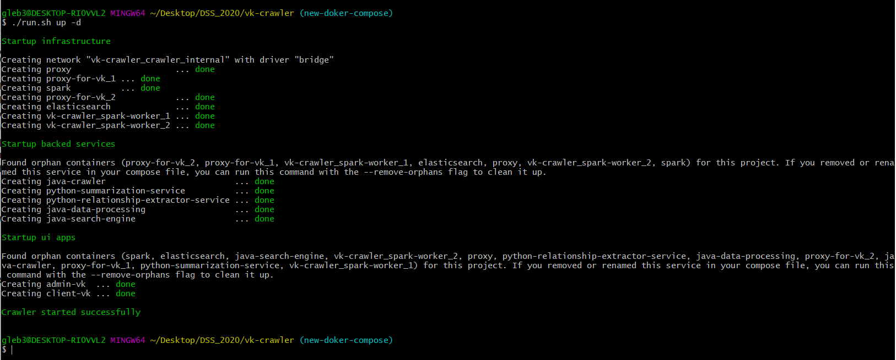
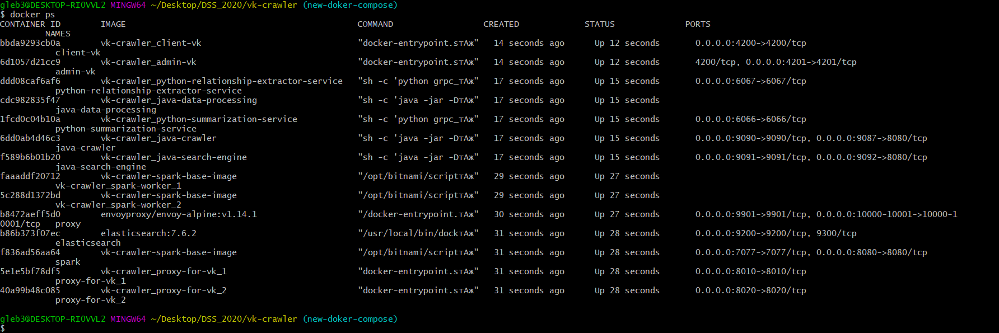
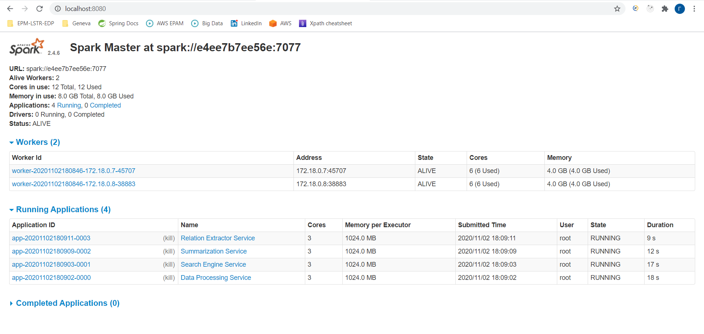

# DSS_2020
First, local sturtup
1. open git bash
2. ./run.sh build (pull latest images from my [docker hub](https://hub.docker.com/u/hronosf) - it takes about 5-10 minutes to download depending on your network conection) 
3. ./run.sh up -d

After "./run sh up -d" command you should see:  
  
Run **"docker ps"** - make sure that all containers are healthy:
  
Go to [Spark-Master UI](http://localhost:8080) and check that all services connected to cluster: 

secondly, build analyser image:
	download AI_analyzer from https://drive.google.com/file/d/1BmE0x_jfT4MdRda__g1Ce9mIVX1V6lE/view?usp=sharing and unpack it to analyzer/app
	cd ../analyzer
	docker-compose build analyzer
	docker-compose up -d analyzer

look at java-crawler logs, often it is not up (shows messsage, that sth wrong with DB), then restart all containers

1. go to [admin app](http://localhost:4201)
2. login to ["Vkontakte"](https://vk.com) if needed (app will automaticly redirect to vk OAuth2 page)
3. search for groups/user which walls you want to parse
4. checkout them (here crawler starts)
5. go to [analyzer of images and toponymes](http://localhost:4000)
