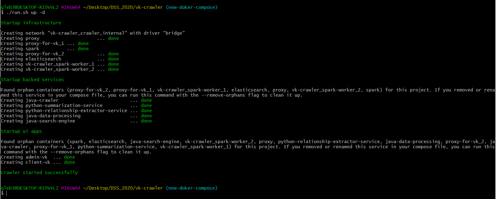
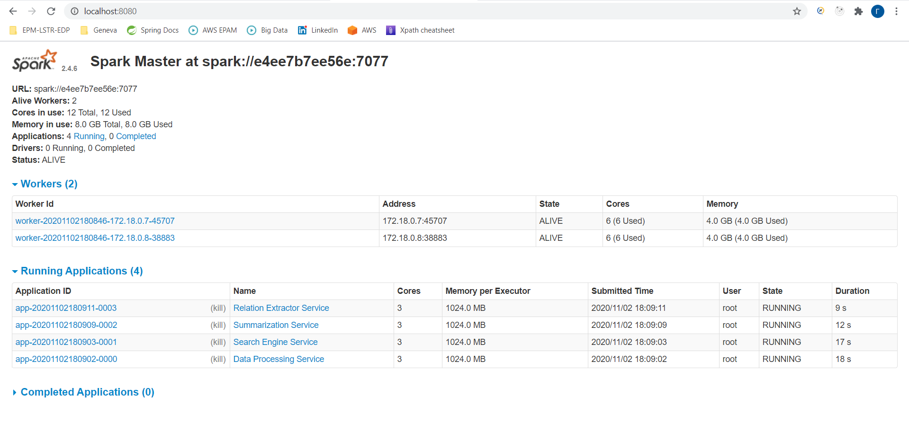
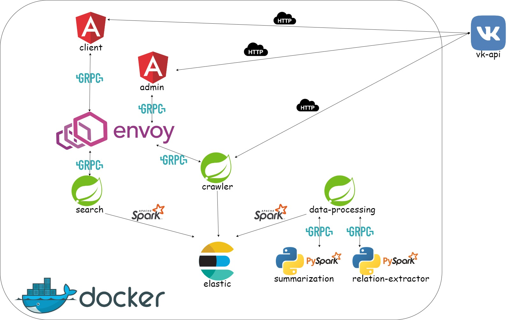

**Description:**   
Автоматический агрегатор данных с ВК (используя АПИ ВК) 
(тексты из пуб. Страниц пользователей, постов в группах заданных администратором) + прослойка с ElasticSearch + микросервисы с нейронками выдающими краткую суть  текстов, пары персонаж - отношение,+ Клиент поиска постов и визуализации графа взаимо отношений пользователей к людям (вася не любит петю и дашу но обажает машу)

**Demo:**
[Youtube](https://www.youtube.com/watch?v=MXfpYYRk6eI)

**For local startup:**
1. open git bash (if you have Windows) or bash (if Unix)
2. ./run.sh build (it takes about 15+ minutes to build depending on the your hardware)
3. ./run.sh up -d

You should see:  
  
Go to [Spark-Master UI](http://localhost:8080) and check that all services connected to cluster: 

**Tips:**
1. For better perfomance use local Spark-3.0.1 && Hadoop-2.7 ([Intallation guide](https://phoenixnap.com/kb/install-spark-on-windows-10))
2. Configure Spark standalone cluster setting via:
    * docker-compose-infra.yml (how much resources allocated for worker)
    * run.sh (how much workers to up)
    * docker-compose-services.yml (how much cores should each spark-service use from each worker, spark-master url)

**How to use:**
1. start up
2. go to [admin app](http://localhost:4201)
3. login to ["Vkontakte"](https://vk.com) if needed (app will automaticly redirect to vk OAuth2 page)
4. search for groups/user which walls you want to parse
5. checkout them (here crawler starts)
6. go to [client app](http://localhost:4200)
7. search with full text or by user/group id among parsed posts
8. enjoy it :)

 **Project infrastructure:**  

